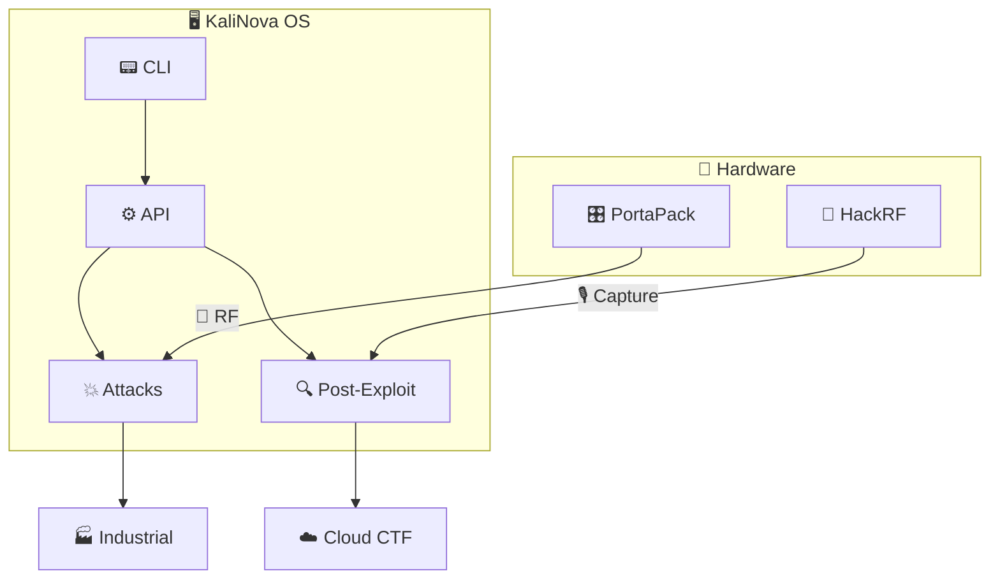
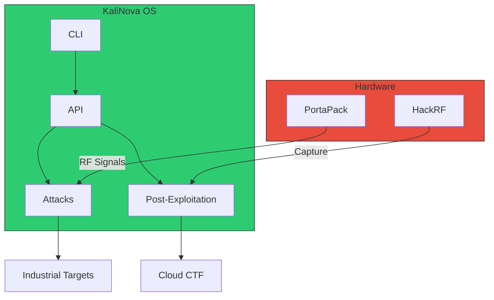

<div align="center">
  
  
  ``` 
  ██╗  ██╗ █████╗ ██╗     ███╗   ██╗ ██████╗ ██╗   ██╗ █████╗ 
  ██║ ██╔╝██╔══██╗██║     ████╗  ██║██╔═══██╗██║   ██║██╔══██╗
  █████╔╝ ███████║██║     ██╔██╗ ██║██║   ██║██║   ██║███████║
  ██╔═██╗ ██╔══██║██║     ██║╚██╗██║██║   ██║╚██╗ ██╔╝██╔══██║
  ██║  ██╗██║  ██║███████╗██║ ╚████║╚██████╔╝ ╚████╔╝ ██║  ██║
  ╚═╝  ╚═╝╚═╝  ╚═╝╚══════╝╚═╝  ╚═══╝ ╚═════╝   ╚═══╝  ╚═╝  ╚═╝
  ```

  ### *The Next-Gen Pentesting Framework*  

  [](LICENSE)  
  [](https://www.python.org/)  
  [](https://discord.gg/invite-link)  

  > *"Cuando nmap y Metasploit no son suficientes..."*  

</div>

---

  # 𝕶𝖆𝖑𝖎𝕹𝖔𝖛𝖆  
  ### *Next-Gen Pentesting Framework*  

  [](https://github.com/KevinDevSecOps/KaliNova/releases)
  [](https://www.python.org/)
  [](LICENSE)
  [](https://discord.gg/your-invite)


<div style="background:#1a1a1a;padding:15px;border-radius:10px">
  <p style="color:#FF6B6B;font-weight:bold">PortaPack ➔ <span style="color:#4ECDC4">KaliNova</span></p>
  <div style="margin-left:20px">
    <p>├─ RF Scan</p>
    <p>├─ Exploit DB</p>
    <p>└─ <span style="color:#FFE66D">GPS Spoofing</span></p>
  </div>
</div>
---
```markdown
<div align="center">
 width="600" alt="KaliNova Logo">
  <h1>⚡ KaliNova - La Evolución del Hacking Ético ⚡</h1>
  <p>
    <em>"No rompemos sistemas, los hacemos evolucionar"</em>
  </p>

  [](https://github.com/KevinDevSecOps/KaliNova/stargazers)
  [](LICENSE)
  [](https://twitter.com/KevDevSecOps)
</div>

---

## 🚀 **¿Qué es KaliNova?**  
KaliNova es un **arsenal de herramientas de hacking ético** escritas en Rust, Python y Go, diseñadas para:  

- 🔍 **Auditorías profesionales** con IA integrada  
- 🛡️ **Defensa proactiva** contra amenazas 0-day  
- ⚡ **Rendimiento extremo** (Gracias a Rust 🦀)  

```ascii
  _____________________
 /  _____/______ _______
/   \  __\_  __ \\_  __ \
\    \_\  \  | \/ |  | \/
 \______  /__|    |__|
        \/
```

---

## 🌌 **Features Destacadas**  

| Módulo         | Descripción                          | Tecnología |
|----------------|--------------------------------------|------------|
| **NovaVision** | Escáner visual de dispositivos IoT   | Python+YOLO|
| **NovaStealth**| VPN indetectable multi-protocolo     | Rust+WireGuard |
| **RFID Nova**  | Clonación segura de tarjetas         | Proxmark3  |

---

## 🛠️ **Instalación Relámpago**  

```bash
# 1. Clona el repositorio
git clone --depth=1 https://github.com/KevinDevSecOps/KaliNova.git
cd KaliNova

# 2. Instala dependencias
./install.sh --full

# 3. ¡Hackea el planeta!
sudo nova scan --target 192.168.1.0/24
```

> 💡 **Tip**: Usa `--lite` en sistemas con pocos recursos.

---

## 🎮 **Demo Interactiva**  
[](https://replit.com/@KevDevSecOps/KaliNova-Demo)  
*(Prueba NovaVision en tu navegador sin instalar nada)*  

---

## 📡 **Roadmap 2024**  
- [x] Lanzamiento v1.0 (Q1 2024)  
- [ ] Integración con GPT-4 para análisis automático  
- [ ] Versión para Raspberry Pi 5  

---

## ⚠️ **Aviso Legal**  
```diff
- SOLO USO ÉTICO BAJO AUTORIZACIÓN
- El mal uso es ILEGAL y puede llevarte a la cárcel
+ Únete a nuestra comunidad de hacking responsable: https://discord.gg/novacrew
```

---

<div align="center">
  <h3>🌐 ¿Listo para la próxima generación de seguridad ofensiva?</h3>
  
</div>
```

---


## 🚀 Features
| Module          | Description                          | Tech Used          |
|-----------------|--------------------------------------|--------------------|
| `AutoExploit`   | CVE Scanning & Weaponization         | NVD API, Metasploit|
| `StealthMode`   | EDR/AV Evasion                       | XOR, Process Injection |
| `AI Assistant`  | GPT-4 Powered Exploit Crafting       | OpenAI API         |

```python
# Quick Example:
from kalinova.exploit import ZeroDayHunter
ZeroDayHunter("CVE-2023-1234").execute(target="192.168.1.1")
```

---

## 📦 Installation
```bash
# Option 1: Auto-Install (Kali/Arch)
curl -sSL https://kalinova.tools/install | bash

# Option 2: Manual
git clone https://github.com/KevinDevSecOps/KaliNova.git
cd KaliNova && pip install -e .
```

---

## 🛠️ Project Structure
```bash
core/
├── exploit/       # CVE → Exploit Automation
├── evasion/       # Bypass Techniques  
├── ai/            # LLM Integration
configs/
├── c2_profiles/   # Covenant, Metasploit
└── logging.conf   # Stealth Logging
## 🌐 KaliNova Architecture

**Key**:  
- 🟢 **Verde**: KaliNova Core  
- 🔴 **Rojo**: Hardware Integration
```

## 📜 License 
KaliNova is licensed under the [GNU GPLv3](LICENSE). Key requirements:
- Derivative works must remain open-source
- Use only for authorized security testing

---

## 🤝 Contributing
1. Fork the Project  
2. Create your Feature Branch:  
   ```bash
   git checkout -b feat/amazing-feature
   ```
3. Submit a **Pull Request** with:
   - Tests (`pytest tests/`)  
   - Docs Updated  

---

## ⚠️ Legal Disclaimer
**KaliNova is for authorized penetration testing only.**  
*By using this tool, you agree to:*
- [ ] Comply with all applicable laws  
- [ ] Obtain explicit permission  
- [ ] Never attack non-owned systems  

---

<div align="center">
  <sub>Created with ♥ by KevinDevSecOps | Need help? Open an Issue</sub>
</div>
```
## 🚀 Features  
- **Explotación en 1 clic**: Búsqueda automática de CVEs y generación de payloads.  
- **Evasión Activa**: Bypass de EDR/AV con técnicas de ofuscación dinámica.  
- **Multiplataforma**: Kali, Arch, WSL2 y Docker.  
- **IA Integrada**: GPT-4 para análisis de vulnerabilidades.  

```python
# Ejemplo de uso:  
from kalinova.exploit import ZeroDayHunter  
ZeroDayHunter("CVE-2023-1234").run(target="192.168.1.1")  
```

---

## 📦 Instalación  
```bash
# Opción 1: Instalador automático  
curl -sSL https://kalinova.tools/install.sh | bash  

# Opción 2: Manual (Devs)  
git clone https://github.com/KevinDevSecOps/KaliNova.git  
cd KaliNova && pip install -r requirements.txt  
```

---

## 🖥️ Módulos Principales  
| Módulo          | Descripción                          | Comando Ejemplo              |  
|-----------------|--------------------------------------|------------------------------|  
| `autoexploit`   | Escaneo + explotación automática     | `kalinova --autoexploit 10.0.0.1` |  
| `stealthify`    | Ofuscación de tráfico                | `kalinova --stealthify --protocol DNS` |  
| `ai_advisor`    | Consultas de seguridad con IA        | `kalinova --ai "¿Cómo explotar Heartbleed?"` |  

---

## 🌍 Internacionalización  
```bash
# Ejecutar en español:  
LANG=es kalinova --help  

# Idiomas soportados:  
🇺🇸 🇪🇸 🇫🇷 🇩🇪 🇯🇵 🇷🇺 🇨🇳 🇵🇹 🇦🇪 🇮🇳  
```

---

## 🛠️ Cómo Contribuir  
1. Haz fork del repo.  
2. Crea una rama:  
   ```bash  
   git checkout -b feat/nueva-funcion  
   ```  
3. Envía un **Pull Request** con:  
   - ✔️ Tests actualizados.  
   - 📝 Docs en inglés/español.  

---

## ⚠️ Disclaimer  
**KaliNova es para uso legal en pruebas de penetración autorizadas.**  
*El uso malintencionado es responsabilidad exclusiva del usuario.*  

---

<div align="center">
  
  ```bash
  # ¿Listo para el hacking ético?
  echo "¡KaliNova está vivo! 💻⚡"
  ```
  
</div>
```

---
[](https://github.com/KevinDevSecOps/BlackMint)
// ¡Mensaje para el equipo!
fn main() {
    println!("🔥 ¡KaliNova está listo para quemar sistemas!"); 
    println!("💻 Target: Todos los que se crucen en el camino (autorizados)");
}
<p align="center">
  
</p>
