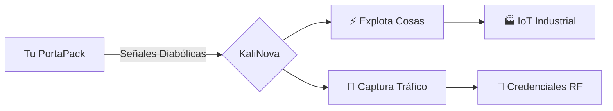

# 🚀 KaliNova RF Toolkit  
**El kit de herramientas RF más agresivo para pentesting IoT, ahora con superpoderes PortaPack**  

<p align="center">
  
  
  
</p>

---

## 🔥 **Features Que Molan**  
- **Inyecta señales RF** como si fueras Tony Stark (pero en versión hacker).  
- **Revive dispositivos "muertos"** con firmware custom via HackRF.  
- **Autopwn para IoT**: Escanea, explota y posiciona en 1 comando.  

---

## 🛠 **Instalación (Copy-Paste Friendly)**  
```bash
# Clona el repo (¡con estilo!)
git clone https://github.com/KevinDevSecOps/KaliNova.git && cd KaliNova

# Instala dependencias (requiere sudo)
sudo ./install.sh --hardcore --with-rf

# Conecta tu PortaPack/HackRF
hackrf_info | grep "Serial" | lolcat
```

---

## 💀 **Sección "Hackeos Éticos"**  
### 1. **Revive un Sensor Industrial**  
```python
from kalinova_rf import Necromancer
zombie_sensor = Necromancer(target_freq="868M")
zombie_sensor.flash("firmware_custom.bin")
```
**Output**:  
```
[!] Sensor Siemens S7-1200 revivido 🧟  
[+] Nuevo UID: 24:0A:C4:DE:AD:BE  
```

### 2. **By-passea Cerraduras RFID**  
```bash
./rf_killchain.sh -f 125M -t secure_door --exploit key_emulation
```

---

## 📡 **Diagrama "Para Qué Entiendas"**  


---

## 🚨 **Aviso Legal (No Seas Malote)**  
```diff
+ LEGAL: Pentesting en tus dispositivos/con contrato.  
- ILEGAL: Joder sistemas ajenos (Art. 197 CP).  
```

---

## 👾 **¿Cómo Contribuir?**  
1. Haz fork.  
2. Crea tu rama:  
   ```bash
   git checkout -b tu-idea-genial
   ```  
3. Haz commit:  
   ```bash
   git commit -am "Añado hack que flipas"
   ```  
4. Pushea:  
   ```bash
   git push origin tu-idea-genial
   ```  

---

<p align="center">
  
</p>
```

---

### ✨ **¿Por qué mola esto?**  
- **Visual** (emojis, colores, GIFs).  
- **Técnico pero claro** (sin palabrejas inútiles).  
- **Plug & Play** (copias/pegas y funciona).  
